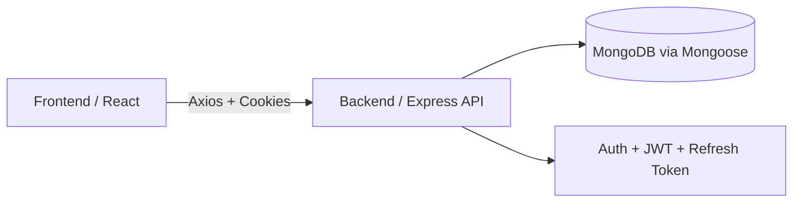

# Campus Mart


<p align="center">
  
  
  
</p>

<p align="center">
  Modern marketplace architecture with a React client and Express API.
</p>

## Quick Structure

```text
frontend/  -> React + Vite + Tailwind client
backend/   -> Express + MongoDB API
```

## Stack

- Frontend: React, Vite, React Router, Axios, Tailwind CSS
- Backend: Express, Mongoose, JWT, Zod, Resend, Google OAuth
- Security: Helmet, CORS, cookie-parser, XSS filter, rate limiting

## System Flow



## API Groups

- `/health`
- `/api/auth`
- `/api/user` (protected)
- `/api/product`
- `/api/report` (protected)
- `/api/address` (protected)
- `/api/imagekit` (protected)
- `/api/wishlist` (protected)

## Frontend Routes (Core)

- Public: `/`, `/product/:id`, `/category/:categoryName`, `/price`
- Auth: `/login`, `/signup`, `/forgot-password`, `/reset-password/:token`, `/verify-email`, `/checkEmail`
- Protected: `/profile`, `/wishlist`, `/myorders`, `/chat`, `/notification`, `/upload`, `/contact`, `/termscondition`

## Environment

Backend `.env` keys (from `backend/.env.sample`):
`PORT`, `FRONTEND_URL`, `MONGO_URL`, `SECRET_KEY_ACCESS_TOKEN`, `SECRET_KEY_REFRESH_TOKEN`, `CLOUDINARY_CLOUD_NAME`, `CLOUDINARY_API_KEY`, `CLOUDINARY_API_SECRET`, `RESEND_API_KEY`, `NODE_ENV`, `GOOGLE_CLIENT_ID`, `GOOGLE_CLIENT_SECRET`, `GOOGLE_REDIRECT_URI`

Frontend `.env` keys (from `frontend/.env.sample`):
`VITE_IMAGEKIT_PUBLIC_KEY`, `VITE_IMAGEKIT_URL_ENDPOINT`, `VITE_API_BASE_URL`

## Run Locally

```bash
cd backend && npm install && npm run dev
cd ../frontend && npm install && npm run dev
```

## License

ISC
